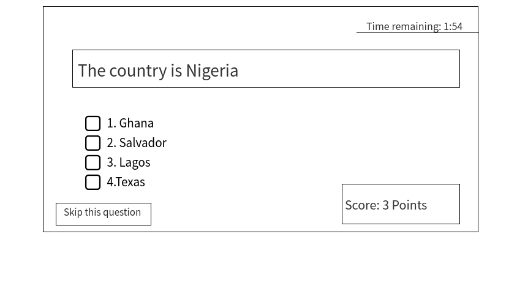
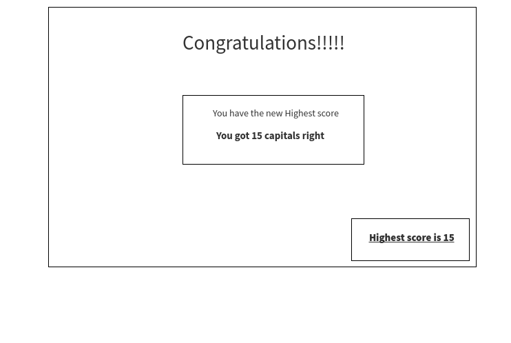

# Test Your Knowledge on countries capital states!

## overview
    for someone who is a big fan of traveling, i feel like whatever project i emback on has to include that in a way. This project creates a fun quize game that tests the users knowledge on the capital state of each country in the world.

    your are promted to start the game, which takes you to a different page. In the second page, you are asked which of the following you think is the capital of a specific country. each game has a 2 minute timer and the score of whatever you get right is displayed at the end. The game keeps track of highest score the user ever gets and updates it if it is ever beaten.

#### Game rules
    > Once the game is started, the user gets promted to press the start button, after you start the game, you are given a 2 minute timer to guess as many capital of countries has you can. Each country has 4 different option to pick from, and every correct answer increases your score by one. your goal is to try and beat your highest score every time you play.

#### Wireframes

   <!--  -->

   

   

   

### User Stories

> When the user press start, it loads the first page with the questions, and a 2 minute timer starts

> when the user selects a right answer, their score increases by one, and they are moved to the next question.

>when the user selects the wrong answer, they get an indication it was wroung, and they move to the next question.

> when the user selects skip question, they and prompted to the next question.

> After the 2 minutes timer is done, the final score page loads and the user sees their final score.

> If the user beats the highest score, they become the new highest score

### MVP checklist

> the user is asked more than one question 

> The user can select a right or wrong answer

> when they select the right answer their score increses by 1

> the game ends after 2 minutes

### Stretch Goals

> There is a start page 

> There is a skip button

> The highest score displays 
